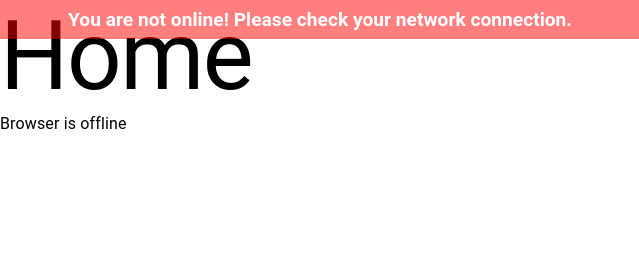

# @ouroboros/react-offline

[](https://www.npmjs.com/package/@ouroboros/react-offline) 

A React component that displays a message when the user is offline.

## Installation
npm
```bash
npm install @ouroboros/react-offline
```

## Using
```javascript
import Offline from '@ouroboros/react-offline';

function App(props) {

	return (
		<Offline />
	);
}
```



## Props

| Name | Type | Required | Description |
|--|--|--|--|
| message | string | no | Default, "You are not online! Please check your network connection." |
| position | "bottom" \| "top" | no | Default, "top" |

## Style

You can set your own styles using the #oc_offline ID, or import / include `node_modules/@ouroboros/react-offline/style.css`.